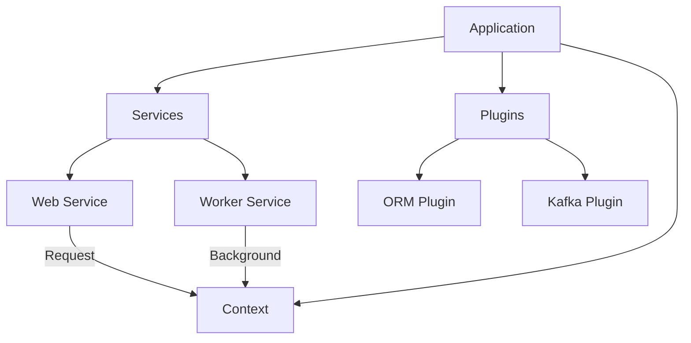

# Golly

> **A composable Go application framework for building production services.**

[](https://pkg.go.dev/github.com/golly-go/golly)
[](https://goreportcard.com/report/github.com/golly-go/golly)
[](https://opensource.org/licenses/MIT)

> [!WARNING] > **v0.9.1 Breaking Changes**
> This release introduces significant architectural improvements that require migration:
>
> - **Logger**: Replaced `logrus` with a zero-allocation custom logger. Syntax has changed (see `doc.go`).
> - **Context**: `WebContext` no longer implements `context.Context` directly to prevent unintended interface promotion. Use `wctx.Context()` to access the underlying context.
> - **Services**: `golly.WebService` is no longer loaded by default, as we move away from web-first into service-first architecture.

**Golly** is a general-purpose application framework for building production Go services—web APIs, background workers, event consumers, IoT systems, and more.

Started as glue code between popular libraries, it evolved over years of production use into a cohesive framework with custom implementations for tighter integration. Build web services, smart home automation, data pipelines, or any Go application with structured logging, lifecycle management, and a universal context abstraction.

---

## Philosophy: Build Once, Deploy Anywhere

One codebase. Multiple deployment modes.

Golly lets you define services (Web, Worker, Consumer, Cron, etc.) in a single binary. Deploy the same code as different processes—each running only what it needs.

**Examples:**

- **HRIS Backend**: Web API + Kafka consumers + scheduled jobs
- **Smart Home**: IoT device handlers + automation workers + admin API
- **Data Pipeline**: Stream processors + batch jobs + monitoring dashboard

All sharing the same domain logic, context, and configuration. **Write once. Scale independently.**

---

## Obsessive Performance

We don't just say "fast"; we prove it. Golly is engineered for **High-Performance** in the hot paths.

| Component  | Operation          | Latency     | Allocations   |
| :--------- | :----------------- | :---------- | :------------ |
| **Logger** | `Log.Opt().Info()` | **~133 ns** | **0 allocs**  |
| **Router** | `GET /blog/:id`    | **~136 ns** | **1 alloc**\* |
| **CORS**   | Origin Validation  | **~12 ns**  | **0 allocs**  |
| **Render** | JSON Response      | **~157 ns** | **3 allocs**  |

_\*The single router allocation is the `Context` object. We explicitly do NOT pool the core `Context` to prevent data races and ensure safe, independent propagation across goroutines (e.g. `Detach()`). Safety > 1 alloc._

#### Benchmark Methodology

- **Environment**: Apple M3 Max, 14-Core, Go 1.25.
- **Flags**: `-benchmem -bench .`
- **Methodology**:
  - **Logger**: `log.Opt().Info()` (Zero-Alloc path) vs `zap.L().Info()`. Excludes serialization time (handled by buffer pool).
  - **Router**: `GET` request with 1 param. Includes route matching + context creation. Excludes HTTP write syscalls.

---

## ⚡ Quick Start: Hello World

Minimal setup. Maximum power.

```go
package main

import (
    "github.com/golly-go/golly"
    "github.com/golly-go/golly/middleware"
)

func main() {
    golly.Run(golly.Options{
        Name: "minimal-service",
		Services: []golly.Service{&golly.WebService{}},
        Initializer: func(app *golly.Application) error {
            app.Routes().
                Use(middleware.RequestLogger).
                Get("/", func(c *golly.WebContext) {
                    c.Text(200, "Hello, Golly!")
                })
            return nil
        },
    })
}
```

```bash
$ go run main.go start
> INFO listening on :9000
```

## 🛠 Real World Production Example

Golly applications are declarative and easy to reason about. Here is what a real-world production entrypoint looks like:

```go
package main

import (
	"time"

	"github.com/golly-go/golly"
	"github.com/golly-go/golly/middleware"
	"github.com/golly-go/plugins/orm"
	"github.com/golly-go/plugins/eventsource"
	"github.com/golly-go/plugins/kafka"
)

func main() {
	golly.Run(golly.Options{
		Name:    "hris-backend",
		Version: "1.0.0",

		// Define functional workloads that can run in this binary
		Services: []golly.Service{
			&golly.WebService{},      // HTTP API
			&worker.JobProcessor{},   // Background Jobs
			&kafka.ConsumerService{}, // Message Consumer
		},

		// Structured, ordered initialization chain
		Initializer: golly.AppFuncChain(
			lib.Initializer,
			domains.Initializer,
			infra.Initializer,
		),

		// Drop-in Plugins for enterprise capabilities
		Plugins: []golly.Plugin{
			// Database with automatic configuration
			orm.NewOrmPlugin(func(app *golly.Application) (orm.PostgresConfig, error) {
				return orm.PostgresConfig{
					Host:         app.Config().GetString("db.host"),
					MaxOpenConns: 100,
					YAMLConfig:   true, // Load from config/database.yml
				}, nil
			}),

			// Event Sourcing & Kafka
			kafka.NewPlugin(),
			eventsource.NewPlugin(
				eventsource.PluginWithStore(&gormstore.Store{}),
			),
		},
	})
}
```

---

## Key Features

### 1. Universal Context

Golly's `Context` is the backbone of your application—not just web requests. It works seamlessly across web handlers, Kafka consumers, background workers, and cron jobs.

**Opinionated separation:** `WebContext` is for HTTP-specific concerns (request/response). For everything else, extract the universal `Context`:

```go
// ✅ Extract Context for passing down
func Handler(wctx *golly.WebContext) {
    ctx := wctx.Context() // Universal context

    // Pass ctx, not wctx, to business logic
    result := doBusinessLogic(ctx)
    wctx.JSON(200, result)
}

func doBusinessLogic(ctx *golly.Context) Result {
    // Works in web handlers, workers, consumers, anywhere
    ctx.Logger().Info("Processing payment")

    // Safe detachment for async work
    go func(ctx *golly.Context) {
        detached.Logger().Info("Background job started")
    }(ctx.Detach())

    return Result{}
}
```

**This separation is intentional.** Don't pass `WebContext` to business logic—it couples your domain to HTTP.

### 2. Service Framework, Not Just Web

Define multiple services (Web, Worker, Consumer) in one codebase. Deploy as separate pods that share domain logic but scale independently.

```go
Services: []golly.Service{
    &golly.WebService{},      // HTTP API
    &worker.JobProcessor{},   // Background jobs
    &kafka.ConsumerService{}, // Event consumers
}
```

Each pod runs the same binary, just different services. **Monolithic logic. Independent scale.**

### 3. High-Performance Hot Paths

Obsessively optimized logger, router, and context for production workloads.

```go
// Near-zero allocation logging
logger.Opt().
    Str("service", "payment").
    Int("status", 200).
    Info("Payment processed")
```

See [Obsessive Performance](#obsessive-performance) for benchmarks.

### 4. CLI Built-in

Every Golly app is also a CLI. Define custom admin commands right next to your service code.

```bash
./app start                # Run services
./app service start worker # Run specific service
./app db migrate           # Custom commands
```

### 5. Optional Plugin Ecosystem

Plugins are **completely optional**. Use the core framework with your own integrations, or drop in official plugins for common needs.

**Plugins are detached from the main framework**—you can use Golly without any plugins at all.

```go
// Optional plugins for common needs (ORM, Kafka, Eventsource, etc.)
Plugins: []golly.Plugin{
    orm.NewOrmPlugin(...),
    kafka.NewPlugin(),
    eventsource.NewPlugin(...),
}
```

Available in the separate [`golly-go/plugins`](https://github.com/golly-go/plugins) repository.

---

## 🗺 Concept Map



## 📚 Documentation

- [**Logger Guide**](https://pkg.go.dev/github.com/golly-go/golly#Logger): Zero-alloc usage and configuration.
- [**Context Guide**](https://pkg.go.dev/github.com/golly-go/golly#Context): Usage of `Detach`, `Set`, and `Get`.
- [**Service API**](https://pkg.go.dev/github.com/golly-go/golly#Service): Implementing custom Services.

---

## Installation

```bash
go get github.com/golly-go/golly
```

---

## Contributing

We are building the framework we always wanted to use. If you care about performance, code aesthetics, and developer happiness, join us.

1.  Fork the repo.
2.  Create your feature branch.
3.  Submit a Pull Request.
