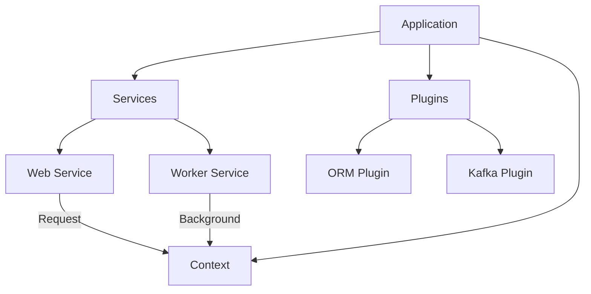

# Golly

> **The Go Service Framework for High-Performance Monoliths**

[](https://pkg.go.dev/github.com/golly-go/golly)
[](https://goreportcard.com/report/github.com/golly-go/golly)
[](https://opensource.org/licenses/MIT)

> [!WARNING] > **v0.9.1 Breaking Changes**
> This release introduces significant architectural improvements that require migration:
>
> - **Logger**: Replaced `logrus` with a zero-allocation custom logger. Syntax has changed (see `doc.go`).
> - **Context**: `WebContext` no longer implements `context.Context` directly to prevent unintended interface promotion. Use `wctx.Context()` to access the underlying context.
> - **Services**: `golly.WebService` is no longer loaded by default, as we move away from web first into service-first architecture.

**Golly** is an ergonomic service framework designed for **production engineering**.

Most Go frameworks are just HTTP routers. Golly is different. It provides the **architecture** to build scalable systems where your API, Background Workers, and Consumer workloads live in a single, cohesive codebase but scale independently.

---

## The Philosophy: Monolithic Logic, Independent Scale

Stop tearing your application apart into microservices just to scale a queue consumer.

Golly allows you to define multiple **Services** (Web, Worker, Consumer) in one binary. In production, you deploy the same binary as different "Pods", each running only the workload it needs.

- **Pod A (Web)**: API Traffic, highly scalable, stateless.
- **Pod B (Worker)**: Background jobs, memory-intensive.
- **Pod C (Consumer)**: Kafka stream processor, throughput-optimized.

All sharing the same models, domain logic, and utilities. **Zero logic duplication. Infinite scale.**

---

## Obsessive Performance

We don't just say "fast"; we prove it. Golly is engineered for **High-Performance** in the hot paths.

| Component  | Operation          | Latency     | Allocations   |
| :--------- | :----------------- | :---------- | :------------ |
| **Logger** | `Log.Opt().Info()` | **~133 ns** | **0 allocs**  |
| **Router** | `GET /blog/:id`    | **~136 ns** | **1 alloc**\* |
| **CORS**   | Origin Validation  | **~12 ns**  | **0 allocs**  |
| **Render** | JSON Response      | **~157 ns** | **3 allocs**  |

_\*The single router allocation is the `Context` object. We explicitly do NOT pool the core `Context` to prevent data races and ensure safe, independent propagation across goroutines (e.g. `Detach()`). Safety > 1 alloc._

#### Benchmark Methodology

- **Environment**: Apple M3 Max, 14-Core, Go 1.25.
- **Flags**: `-benchmem -bench .`
- **Methodology**:
  - **Logger**: `log.Opt().Info()` (Zero-Alloc path) vs `zap.L().Info()`. Excludes serialization time (handled by buffer pool).
  - **Router**: `GET` request with 1 param. Includes route matching + context creation. Excludes HTTP write syscalls.

---

## ⚡ Quick Start: Hello World

Minimal setup. Maximum power.

```go
package main

import (
    "github.com/golly-go/golly"
    "github.com/golly-go/golly/middleware"
)

func main() {
    golly.Run(golly.Options{
        Name: "minimal-service",
		Services: []golly.Service{&golly.WebService{}},
        Initializer: func(app *golly.Application) error {
            app.Routes().
                Use(middleware.RequestLogger).
                Get("/", func(c *golly.WebContext) {
                    c.Text(200, "Hello, Golly!")
                })
            return nil
        },
    })
}
```

```bash
$ go run main.go start
> INFO listening on :9000
```

## 🛠 Real World Production Example

Golly applications are declarative and easy to reason about. Here is what a real-world production entrypoint looks like:

```go
package main

import (
	"time"

	"github.com/golly-go/golly"
	"github.com/golly-go/golly/middleware"
	"github.com/golly-go/plugins/orm"
	"github.com/golly-go/plugins/eventsource"
	"github.com/golly-go/plugins/kafka"
)

func main() {
	golly.Run(golly.Options{
		Name:    "hris-backend",
		Version: "1.0.0",

		// Define functional workloads that can run in this binary
		Services: []golly.Service{
			&golly.WebService{},      // HTTP API
			&worker.JobProcessor{},   // Background Jobs
			&kafka.ConsumerService{}, // Message Consumer
		},

		// Structured, ordered initialization chain
		Initializer: golly.AppFuncChain(
			lib.Initializer,
			domains.Initializer,
			infra.Initializer,
		),

		// Drop-in Plugins for enterprise capabilities
		Plugins: []golly.Plugin{
			// Database with automatic configuration
			orm.NewOrmPlugin(func(app *golly.Application) (orm.PostgresConfig, error) {
				return orm.PostgresConfig{
					Host:         app.Config().GetString("db.host"),
					MaxOpenConns: 100,
					YAMLConfig:   true, // Load from config/database.yml
				}, nil
			}),

			// Event Sourcing & Kafka
			kafka.NewPlugin(),
			eventsource.NewPlugin(
				eventsource.PluginWithStore(&gormstore.Store{}),
			),
		},
	})
}
```

---

## Key Features

### 1. The Supercharged Context

Golly's `Context` is the spine of your request. It's not just a bag of values; it's an intelligent carrier for **Identity**, **Logging**, and **Tracing**.

```go
// Spawn a goroutine that survives the request but keeps the trace ID
go func(ctx *golly.Context) {
    // Detaches from parent cancellation, but keeps Logger + Meta
    detached := ctx.Detach()

    // Logs with original Request ID: "job_processed request_id=..."
    detached.Logger().Info("Job processed in background")
}(c.Context())
```

### 2. High-Performance Logger

Why use `zap` when you can have something built-in and cleaner?

```go
// Near-Zero Heap Allocations. Typesafe.
logger.Opt().
    Str("service", "payment").
    Int("status", 200).
    Dur("latency", duration).
    Info("Payment processed")
```

### 3. CLI Built-in

Every Golly app is also a CLI. Define custom admin commands right next to your service code.

```go
// Define a custom command: ./app db truncate
{
    Use: "truncate",
    Run: golly.Command(func(a *golly.Application, cmd *cobra.Command, args []string) error {
        return a.DB().Exec("TRUNCATE users").Error
    }),
}
```

```bash
# Run the web server
./app start

# Run a specific service
./app service start worker

# Run custom commands
./app db truncate
```

### 4. Plugin Ecosystem

Plugins are first-class citizens with lifecycle hooks (`Initialize`, `PreBoot`).

```go
// Plugins enforce initialization order and dependency injection
eventsource.NewPlugin(
    eventsource.PluginWithStore(&gormstore.Store{}),
    eventsource.PluginWithDispatcher(kafkaPlugin),
)
```

---

## 🗺 Concept Map



## 📚 Documentation

- [**Logger Guide**](https://pkg.go.dev/github.com/golly-go/golly#Logger): Zero-alloc usage and configuration.
- [**Context Guide**](https://pkg.go.dev/github.com/golly-go/golly#Context): Usage of `Detach`, `Set`, and `Get`.
- [**Service API**](https://pkg.go.dev/github.com/golly-go/golly#Service): Implementing custom Services.

---

## Installation

```bash
go get github.com/golly-go/golly
```

---

## Contributing

We are building the framework we always wanted to use. If you care about performance, code aesthetics, and developer happiness, join us.

1.  Fork the repo.
2.  Create your feature branch.
3.  Submit a Pull Request.
